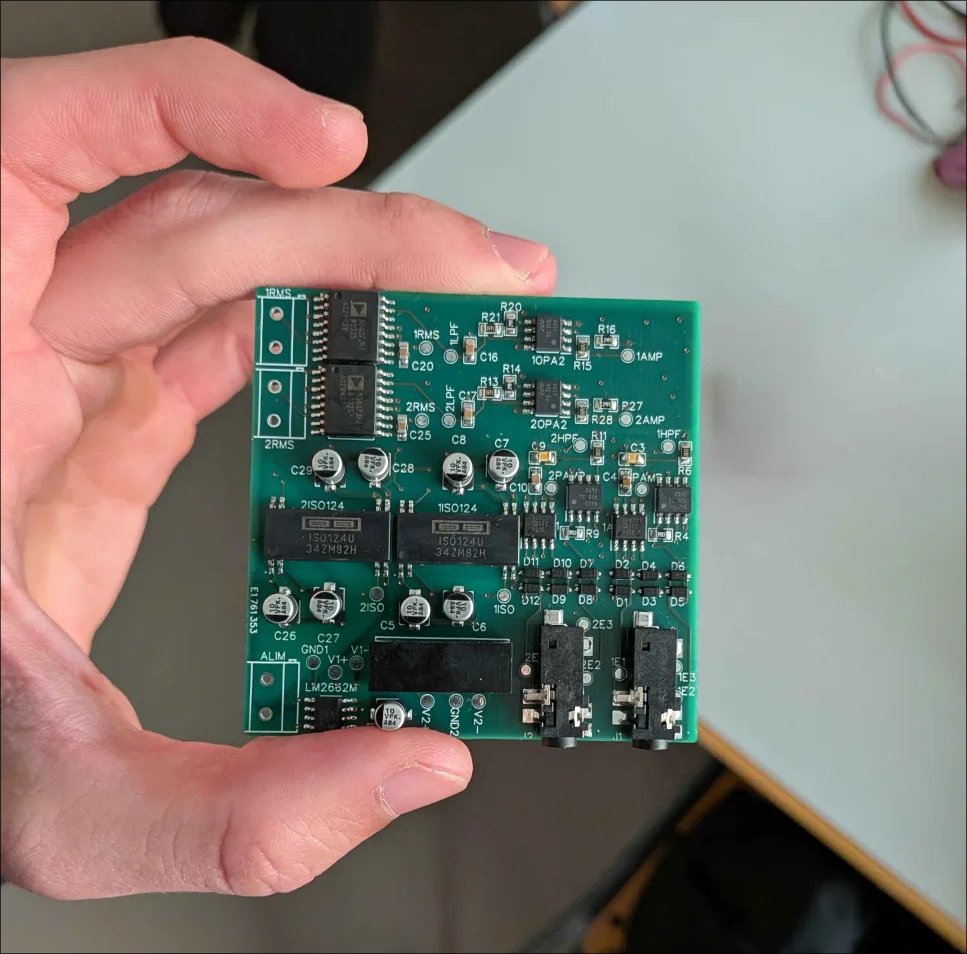
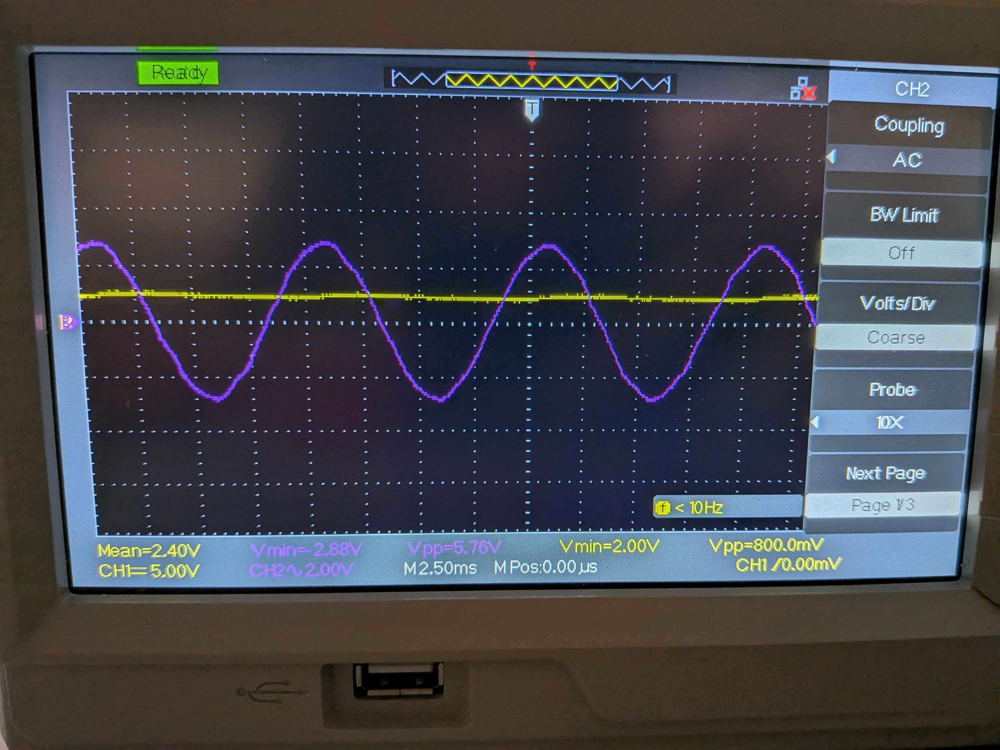

import EMGSignalVisualizer from '../../react/components/EMGSignalVisualizer';

## The Biological Challenge

Extracting surface electromyography (sEMG) signals is an exercise in extreme signal-to-noise ratios. A human forearm is a noisy antenna. When a muscle fiber fires, the resulting action potential propagates through thick layers of fat, interstitial fluid, and skin—acting as a massive low-pass filter and attenuator. By the time that signal reaches a pair of dry Ag/AgCl electrodes, its amplitude is measured in microvolts ($\mu V$).

But it's not just small; it's drowning. We are bathed in a sea of 50/60Hz electromagnetic interference from the very lights and wall outlets around us. We have motion artifacts from the electrode sliding against the skin during movement, which manifests as a massive, sweeping low-frequency baseline wander.

As part of **[Daidalonic](https://daidalonic.com/)**—a student-led group dedicated to developing biomedical devices—we needed a robust way to extract these buried intent signals in real-time for our prosthetic competition. This birthed **CUPPER**: a 2-channel EMG filtering PCB designed strictly through recursive decomposition. We refused to drop a "black box" biometric IC onto the board. If we didn't understand the discrete math of the signal, we didn't use it.

## The Signal Chain Architecture

To pull the signal from the noise, we designed a multi-stage analog front-end (AFE). Each stage in the CUPPER DAQ has a singular, mathematically precise role.

### 1. The Instrumentation Amplifier (INA)
The journey begins at the Instrumentation Amplifier. Its job is Common Mode Rejection (CMRR)—subtracting the noise present on both electrodes (like the 60Hz hum) and amplifying only the difference between them. Initially configured for a gain of $10 V/V$, we later boosted it to $17 V/V$.

### 2. The High-Pass Filter (HPF)
Next, the signal hits a $30 \text{Hz}$ active High-Pass Filter. This is critical. The baseline wander from movement artifacts sits heavily between $0.1 \text{Hz}$ and $20 \text{Hz}$. If we amplify the raw signal further without stripping this low-frequency drift, we risk saturating our op-amps and clipping the signal entirely. 

### 3. Isolation
Safety and SNR dictated a galvanic isolation stage. This protects the human from any fault currents back-propagating from the microcontroller, whilst simultaneously breaking ground loops that introduce massive noise.

### 4. The Post-Amp & Low-Pass Filter (LPF)
Once safely across the isolation barrier, we hit the signal with a massive $60 V/V$ post-amplification stage, bringing our total system gain to roughly $1020 V/V$ ($17 \times 60$). Immediately after, a $300 \text{Hz}$ Low-Pass filter strips out high-frequency thermal noise and serves as our anti-aliasing filter before digitization.

### 5. RMS-to-DC Conversion
Finally, the signal passes through a precision rectifier and integrator, effectively outputting the Root-Mean-Square (RMS) envelope of the EMG bursts rather than the raw 100Hz audio-like waveform.

*Oscilloscope reading from a test session: The purple trace shows the high-frequency LPF output (muscle bursting), while the yellow trace is the clean, integrated RMS DC envelope ready for the ADC.*

Below is an interactive simulation of the CUPPER signal chain, demonstrating how the signal morphs as it passes through each stage.

<EMGSignalVisualizer client:only="react" />

## The Iteration: When the Math Fails

Our initial schematics specified the INA gain at $10 V/V$. On paper, this was elegantly conservative. Combined with the $60 V/V$ post-amp, a $600 V/V$ system gain should have scaled a typical $5 \text{mV}$ peak EMG signal to an easily digitized $3\text{V}$ swing.

But physics is unforgiving. During our first real-world dynamic tests, our ADC was starved. We were yielding only about $0.5 \text{V}$ swings during maximum voluntary contraction. 

Where did the math fail? **Skin-electrode impedance.**

Theoretical calculations often assume a pristine, low-impedance connection. In the chaotic environment of a competition, with dry electrodes and sweat, the impedance mismatch created an enormous voltage divider effect at the skin interface. Our actual $\mu V$ yield at the input terminals was a fraction of the physiological norm. 

We had to iterate. We ripped out the $10 V/V$ gain resistor and bumped the INA early-stage gain to $17 V/V$. By amplifying *harder* and *earlier* in the chain (before the noise floor was raised by subsequent active components), we hit our ADC's dynamic range perfectly without sacrificing our SNR.

## The Stability Choice: Realities of Competition

Why implement a hardware RMS converter? Many modern BCI approaches sample the raw, unfiltered waveform at $1000 \text{Hz}$ and perform digital filtering and feature extraction in software.

It came down to stability in high-stakes environments. A prosthetic competition is not a sterile lab. Microcontrollers fail, USB buses drop packets, and processing latency compounds. By handling the heavy lifting in hardware and outputting a slow, smooth, $0-3.3\text{V}$ analog DC envelope, we drastically reduced our embedded requirements. We could sample at a leisurely $50 \text{Hz}$, knowing the hardware had successfully integrated the energy of the muscle twitch. We sacrificed the nuanced frequency data of the raw waveform, but we gained absolute, unshakeable reliability when it mattered most.
